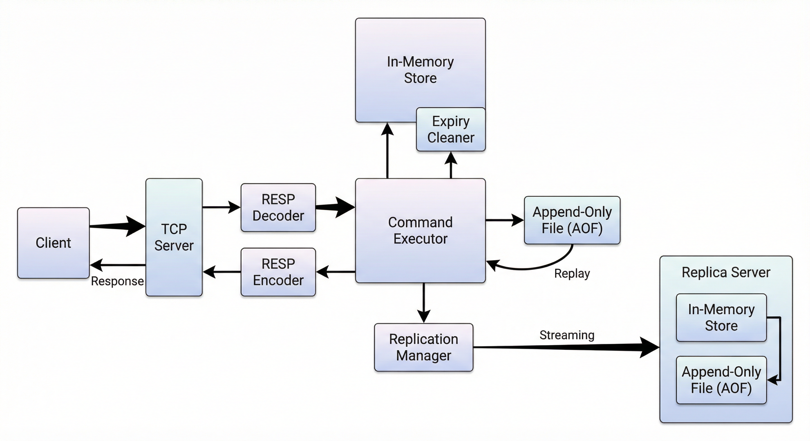
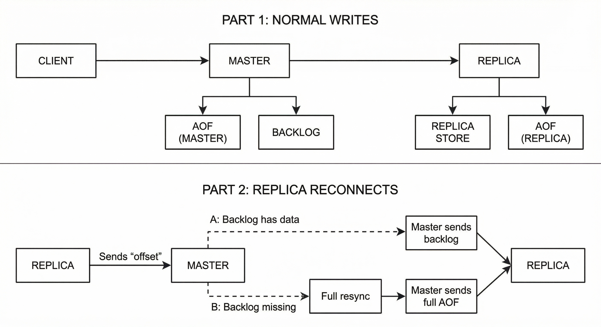

# Redis Server from scratch in TypeScript

A Redis-compatible in-memory data store built using raw TCP sockets and a custom RESP implementation.


Watch demo video

[](https://www.youtube.com/watch?v=iojjgQftbQk)

This project implements:

- TCP networking layer
- RESP protocol parser and encoder
- In-memory storage engine
- Append Only File persistence
- Master replica replication
- Offset-based partial synchronization
- Active and passive key expiration
- Multiple data structures

---

## Architecture



---

# Networking

- TCP server using Node `net`
- Per-socket buffering
- Safe handling of partial packets
- Supports pipelined commands
- Replica connections handled as special clients

---

# RESP Support

Implemented types:

- Simple String
- Bulk String
- Integer
- Array
- Null

---

# Data Model

```ts
type redisValue =
  | {
      type: "string";
      value: string;
    }
  | {
      type: "list";
      value: string[];
    }
  | { type: "hash"; 
      value: Map<string, string> 
    };

interface StoredValue {
  data: redisValue;
  expiresAt: number | null;
}
```

---

# Supported Commands

## Strings

```
SET key value
SET key value EX seconds
GET key
DEL key
EXISTS key
TTL key
EXPIRE key seconds
PEXPIREAT key timestamp
KEYS *
DBSIZE
```

## Lists

```
LPUSH key value [value ...]
RPUSH key value [value ...]
LPOP key [count]
RPOP Key [count]
LLEN key
```

## Hashes

```
HSET key field value
HGET key field
HGETALL key
```

---

# Expiration Model

Two-layer expiration strategy:

Passive expiration  
Key checked on access and removed if expired  

Active expiration  
Background sampling loop cleans expired keys  

TTL persistence stored using:

```
SET key value
PEXPIREAT key absoluteTimestamp
```

Absolute timestamps ensure correct expiration after restart.

---

# Persistence

Append Only File located at:

```
appendonly.aof
```

Restart sequence:

- Load AOF
- Replay commands sequentially
- Restore in-memory state
- Resume accepting connections

---

# Replication



**1. Normal writes**

- Client writes go to Master → Master appends to its AOF and Backlog → Master streams the same data to Replica → Replica applies to Replica Store and Replica AOF.

**2. When replica (re)connects**

- Replica sends its last offset to Master.
- **If backlog has that range:** Master sends only the missing backlog data (partial sync).
- **If backlog does not have it (e.g. connection was down too long):** Master sends the full AOF (full resync), then normal writes continue as above.

---

# Running

## Install

```bash
npm install
```

## Start Master

```bash
npm run start
```

Or with a custom port:

```bash
npx ts-node src/server.ts --port 6379
```

## Start Replica

```bash
npx ts-node src/server.ts --port 6380 --replica 127.0.0.1 6379
```

## Connect

```bash
redis-cli -p 6379
```

## Testing

1. Start the server (in one terminal):

   ```bash
   npm run start
   ```

   Or with a custom port:

   ```bash
   npx ts-node src/server.ts --port 6379
   ```

2. Run the test suite (in another terminal):

   ```bash
   npm test
   ```

   This runs `scripts/test-commands.ts`, which connects to `127.0.0.1:6379`, sends a set of commands (PING, SET/GET, TTL, DEL, LPUSH/LRANGE, HSET/HGETALL, etc.), and checks responses. Exit code 0 means all tests passed.

---

# Failure Handling

- Replica disconnect does not affect master
- Replica reconnect triggers partial resync
- Crash recovery handled via AOF replay
- Expired keys cleaned automatically

---


Built from first principles using TCP and low-level system primitives.
