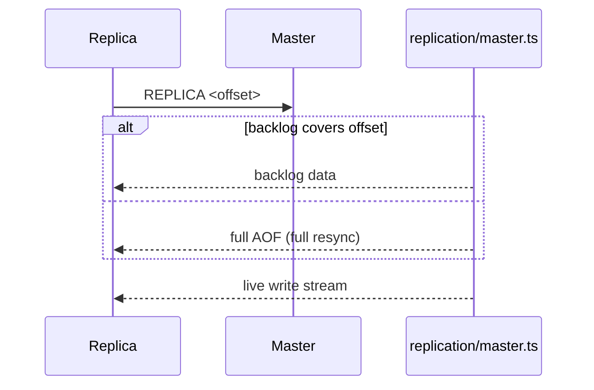

# Redis From Scratch (TypeScript)

Minimal Redis-like server built with:

- Raw TCP sockets
- Custom RESP protocol
- In-memory datastore (strings, lists, hashes)
- Append-Only File (AOF) persistence
- Master-Replica replication
- TTL and background expiration

---

## Architecture


---

## Data Model

```ts
type RedisValue =
  | { type: "string"; value: string }
  | { type: "list"; value: string[] }
  | { type: "hash"; value: Map<string, string> };

type StoredValue = {
  data: RedisValue;
  expiresAt: number | null;
};
```

---

## Supported Commands

**Strings / Keys**

```text
SET key value
SET key value EX seconds
GET key
DEL key
EXISTS key
TTL key
EXPIRE key seconds
PEXPIREAT key timestamp
DBSIZE
KEYS *
```

**Lists**

```text
LPUSH key value [value ...]
RPUSH key value [value ...]
LPOP key [count]
RPOP key [count]
LLEN key
LRANGE key start stop
```

**Hashes**

```text
HSET key field value
HGET key field
HGETALL key
```

**Meta**

```text
PING
INFO
COMMAND
```

---

## Expiration

- Per-key `expiresAt` timestamp
- **Passive:** checked on access
- **Active:** sampled cleanup loop
- TTL persisted via `PEXPIREAT` in AOF

---

## Persistence

- File: `appendonly.aof`
- On write: append RESP command
- On restart: replay AOF → rebuild memory

---

## Replication



- Master tracks `masterOffset` and backlog window
- Replica uses local AOF size as offset

---

## Running

```bash
npm install

# master
npx ts-node src/server.ts --port 6379

# replica (optional)
npx ts-node src/server.ts --port 6380 --replica 127.0.0.1 6379

# client
redis-cli -p 6379
```
